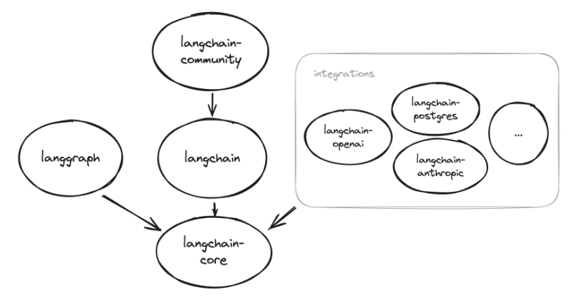

# Langchain Ecosystem

LangChain is a framework for developing applications powered by large language models (LLMs).

To get started with LangChain, you can install the base package using the following command:

pip install langchain

This command installs the core functionalities of LangChain, which is a good starting point. However, much of LangChain's value comes from its ability to integrate with various model providers and datastores. These integrations require additional dependencies that are not included by default.

Ecosystem Packages and Dependencies:
LangChain's ecosystem is built around the langchain-core package, which contains essential base classes and abstractions used by other packages in the ecosystem. All packages, except for the LangSmith SDK, depend on langchain-core

When you install a package, you don't need to manually install its dependencies like langchain-core, as they are automatically included. However, if you need features from a specific version of a dependency, you might choose to install or pin that version explicitly to ensure compatibility with other integration packages you are using.

langchain-core : The langchain-core package is crucial as it provides the foundational abstractions and the LangChain Expression Language. It is automatically installed with the main LangChain package but can also be used independently if needed. To install it separately, you can use:

pip install langchain-core

This setup allows you to leverage LangChain's capabilities effectively, especially when integrating with large language models (LLMs) and other advanced AI applications.

# Integration packages

To fully utilize LangChain, you will likely want to integrate it with various model providers such as OpenAI, Cohere, or HuggingFace. This requires installing additional dependencies specific to each provider.

langchain-{provider}

eg: pip install langchain-openai

Ref : https://python.langchain.com/docs/integrations/platforms/

Any integrations that haven't been split out into their own packages will live in the langchain-community package. Install with:

pip install langchain-community

# CLI

The LangChain CLI is useful for working with LangChain templates and other LangServe projects. Install with:

pip install langchain-cli

# LangGraph - Create stateful, multi-actor applications with LLMs.

Langgraph is a library for building stateful, multi-actor applications with LLMs.

It is used to create agent and multi-agent workflows. Compared to other LLM frameworks, It offers these core benefits: cycles, controllability, and persistence.
It integrates smoothly with LangChain, but can be used without it.

Install with: pip install langgraph

# LangServe - Deploy LangChain runnables and chains as REST APIs.

LangServe helps developers deploy LangChain runnables and chains as a REST API. LangServe is automatically installed by LangChain CLI. If not using LangChain CLI, install with: pip install langserve

# Langsmith - Trace and evaluate your language model applications and intelligent agents

LangSmith is a platform for building production-grade LLM applications.

It allows you to closely monitor and evaluate your application, so you can ship quickly and with confidence. Use of LangChain is not necessary - LangSmith works on its own!

Productionization: Inspect, monitor, and evaluate your apps with LangSmith so that you can constantly optimize and deploy with confidence
