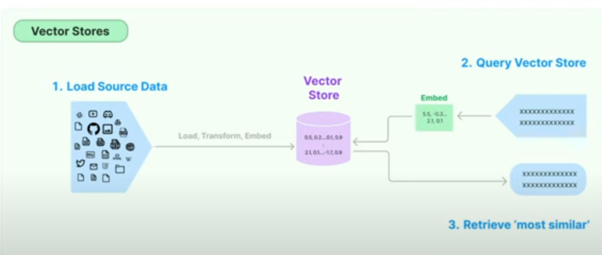
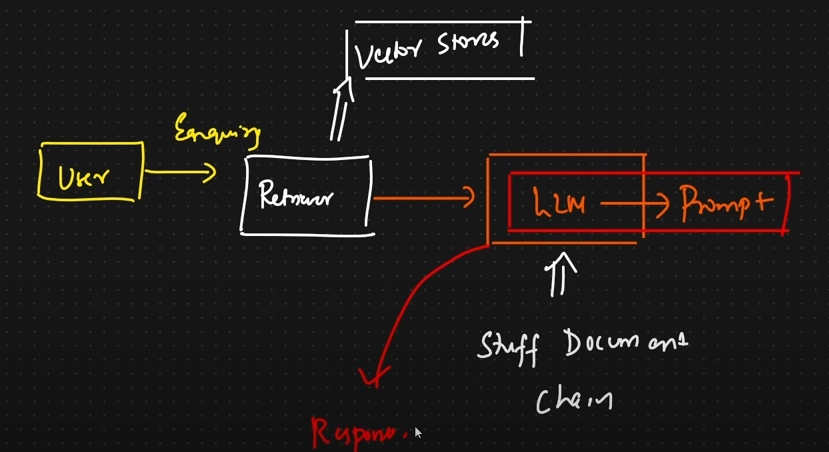

# Environment setup

#create virtual environment

1. Install virtualenv if not installed check using pip list --> pip install virtualenv
2. virtualenv -p python3 <env_name>
3. source <env_name>/bin/activate

Set OpenAI API key , If you don't have an OpenAI API key
Set OPENAI_API_KEY in your environment

Sign up for LangSmith - https://docs.smith.langchain.com/
Set LANGCHAIN_API_KEY, LANGCHAIN_TRACING_V2=true in your environment

pip install -r requirements.txt

1)01-chatbot - chatbot with UI - In this project used streamlit,ChatOpenAI, ChatPromptTemplate to build the application

Learnings:
https://python.langchain.com/v0.2/docs/concepts/#chat-models
https://python.langchain.com/docs/how_to/#chat-models

chatmodels take a sequence of messages as inputs and return chat messages as outputs. LangChain does not host any Chat Models, rather we rely on third party integration

eg:
from langchain_openai import ChatOpenAI \
ChatOpenAI(model="gpt-4o", temperature=0)

Temperature controls the randomness or creativity of the model's output where
low temperature (close to 0) is more deterministic and focused outputs. This is good for tasks requiring accuracy or factual responses.
High temperature (close to 1) is good for creative tasks or generating varied responses.

https://python.langchain.com/v0.2/docs/concepts/#runnable-interface
stream: stream back chunks of the response
invoke: call the chain on an input

2)02-api : using LLM as an API with Langchain , In this project sed langserve and Langsmith

Learnings:
LangServe helps developers deploy LangChain runnables and chains as a REST API.
This library is integrated with FastAPI and uses pydantic for data validation.In addition, it provides a client that can be used to call into runnables deployed on a server.
https://github.com/langchain-ai/langserve/blob/main/examples/llm/server.py

LangSmith is a platform for building production-grade LLM applications. It allows you to closely monitor and evaluate your application, so you can ship quickly and with confidence.

3)03-rag-pipe

In this project Used vectordb,OpenAIEmbeddings,chunks
embeddings, vectors

Performed Load -- Transform - Embed and created a vector store and queried the vector store and Retrieved the most similar results

Learnings:
RAG is a technique for augmenting LLM knowledge with additional data.
LLMs can reason about wide-ranging topics, but their knowledge is limited to the public data up to a specific point in time that they were trained on. If you want to build AI applications that can reason about private data or data introduced after a model’s cutoff date, you need to augment the knowledge of the model with the specific information it needs. The process of bringing the appropriate information and inserting it into the model prompt is known as Retrieval Augmented Generation (RAG)

4)04-chain

when user ask for any enquiry it goes to retreiver (which is an interface tovector store) it goes to llm model (stuff_document_chain) with some prmompt and finally we will get the repsonse

Learnings:
Chain and retreiver integration with LLM

https://python.langchain.com/v0.1/docs/modules/chains/

https://api.python.langchain.com/en/latest/chains/langchain.chains.combine_documents.stuff.create_stuff_documents_chain.html#langchain.chains.combine_documents.stuff.create_stuff_documents_chain
